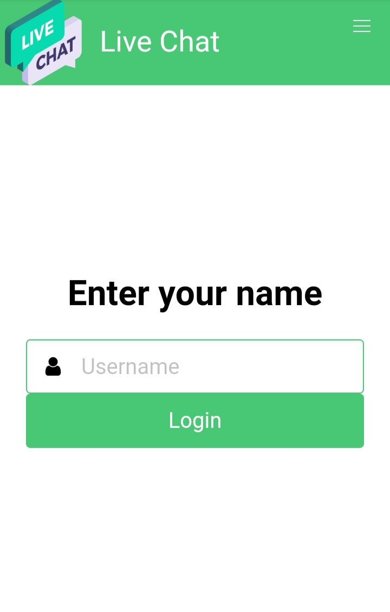
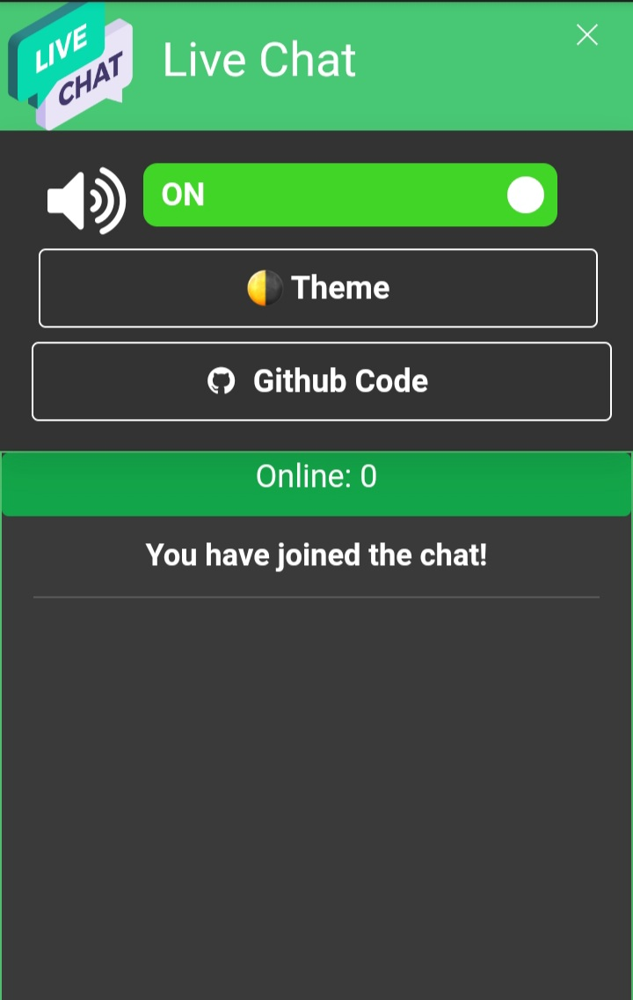

# LIVE CHAT Chat 


[GET STARTED](https://wahyu9kdl.github.io/application/live-chat/public/index.html)
A simple green themed web chat made to learn Node.js and Network Programming<br>

Created @wahyu9kdl - site [wahyu9kdl.github.io](https://wahyu9kdl.github.io/)
Devoloper [AWDEV CORPORATION](https://devoloper.awdev.eu.org)

# Technologies 🧾
<a href="https://nodejs.org/en/"> </a>
<a href="https://socket.io/"></a>
<a href="https://expressjs.com/"></a>
<a href="https://bulma.io/"></a>
<a href="https://www.npmjs.com"></a>


# Preview 🔍






# Quick Start 🚀
```git clone https://github.com/wahyu9kdl/application/live-chat.git```<br>
```cd live-chat```<br>
```npm install```<br>
```npm start  or  nodemon server.js```<br>
```go to localhost:3000```

# What I Learned 🧠
* Node.js basics (async programming, callbacks, anonymous and arrow functions, server side stuff, imports, modules, express, http, path, socket.io)
* Web Sockets
* HTTP/HTTPS
* DOM manipulation, EventListeners, Forms
* How to use CSS Framework (Bulma)
* Simple media queries
* npm basics
* Gathering front-end and back-end together

# License 📑 
(c) 2022 wahyu9kdl. [MIT License](https://github.com/wahyu9kdl/license/)

# Connect with me:
    
<p>    
    <a href=" https://www.alhikmah.my.id/p/mp3-al-quran.html " target="blank"></a>    
    <a href="https://codepen.io/san3" target="blank"></a>
    <a href="https://dev.to/wahyu9kdl" target="blank"></a>
    <a href="https://twitter.com/Awfanspage" target="blank"></a>
    <a href="https://www.linkedin.com/in/ahmad-wahyudi-41b6841b6" target="blank"></a>
    <a href="https://fb.com/awgroupchannel" target="blank"></a>
    <a href="https://instagram.com/awfanspage" target="blank"></a>
    <a href="https://dribbble.com/wahyu9kdl/shots" target="blank"></a>
    <a href="https://wahyu9kdl.medium.com" target="blank"></a>
    <a href="https://m.youtube.com/channel/UC7CRa3nkxakAZx_aRsMwRyA/playlists" target="blank"></a>
    <a href="https://feeds.feedburner.com/Alhikmah9" target="blank"></a>
    <a href="https://wahyu9kdl.github.io"></a>
    <a href="https://m.facebook.com/Awgroupchannel" target="blank"></a>
    <a href="https://devoloper.awdev.eu.org/devoloper.html" target="blank"></a>
    <a href="https://www.awdev.eu.org" target="blank"></a>    
    <a href="https://www.alhikmah.my.id" target="blank"></a>
    <a href="https://www.blogger.com/follow-blog.g?blogID=392213471435482065" target="blank"></a>
 </p>

 

# Support the Project

There are a few things you can do to support the project:

- Star the repository and follow me on GitHub
- Share and upvote on sites like Twitter, Reddit, and Hacker News
- Report any bugs, glitches, or errors that you find
- Translate into other languages

These things motivate me to to keep sharing what I build, and they provide
validation that my work is appreciated! They also help me improve the project.
Thanks in advance!

If you are insistent on spending money to show your support, I encourage you to
instead make a generous donation to one of the following organizations. By
advocating for Internet freedoms, organizations like these help me to feel
comfortable releasing work publicly on the Web.

<p align="center">
<i>Loved the tool? Please consider <a href="https://www.paypal.com/signin?returnUri=https%3A%2F%2Fwww.paypal.com%2Fmyaccount%2Ftransfer%2Fhomepage%2Fexternal%2Fprofile%3FflowContextData%3DdnQz6co9bTO3dXsoaSQoXrylmBBr7Z4w4NgW64GB_WDfmLR52ffZouE7E54etjPgewijP0OxmZksVyVuBbZSxh7v9r8PWndQTi1eJUMZCCj7rrJftUv11NTxekLdOnVJT8vh6pE128RXl6Lq4yOTwu0f2kutdDCQ_qZkx2CTsh1Z3f_OGWFAvKJiKVMHbhq3dn4SWoaIs2dY-I1dSekSdPbZuEHLmCfV3kIA3MpjsPC9xVmmiRxgIY0fsKhMIEnZZQdCZUSJTpNWAnvYDIc-pUIdstyJJzGtqMk0TeqjSG7LnM5jOZufDLI4W8Jbk14B1O-3rAfdL66TgrgjcVRK35l6WhQzVDZEWvimVxtUMuqCgf8gboCEKwLD3ywxApHbM23LBMJY9KBXh6ILB3oZCmB0wYYJxSwmpLiIEW%26amount%3D25%26currencyCode%3DAUD&onboardData=%7B%22country.x%22%3A%22ID%22%2C%22locale.x%22%3A%22id_ID%22%2C%22intent%22%3A%22paypalme%22%2C%22redirect_url%22%3A%22https%253A%252F%252Fwww.paypal.com%252Fmyaccount%252Ftransfer%252Fhomepage%252Fexternal%252Fprofile%253FflowContextData%253DdnQz6co9bTO3dXsoaSQoXrylmBBr7Z4w4NgW64GB_WDfmLR52ffZouE7E54etjPgewijP0OxmZksVyVuBbZSxh7v9r8PWndQTi1eJUMZCCj7rrJftUv11NTxekLdOnVJT8vh6pE128RXl6Lq4yOTwu0f2kutdDCQ_qZkx2CTsh1Z3f_OGWFAvKJiKVMHbhq3dn4SWoaIs2dY-I1dSekSdPbZuEHLmCfV3kIA3MpjsPC9xVmmiRxgIY0fsKhMIEnZZQdCZUSJTpNWAnvYDIc-pUIdstyJJzGtqMk0TeqjSG7LnM5jOZufDLI4W8Jbk14B1O-3rAfdL66TgrgjcVRK35l6WhQzVDZEWvimVxtUMuqCgf8gboCEKwLD3ywxApHbM23LBMJY9KBXh6ILB3oZCmB0wYYJxSwmpLiIEW%2526amount%253D25%2526currencyCode%253DAUD%22%2C%22sendMoneyText%22%3A%22Anda%2520mengirimkan%2520Ahmad%2520wahyudi%22%7D">donating</a>  💸 to help it improve!</i>
</p>
<a href="https://www.paypal.com/signin?returnUri=https%3A%2F%2Fwww.paypal.com%2Fmyaccount%2Ftransfer%2Fhomepage%2Fexternal%2Fprofile%3FflowContextData%3DdnQz6co9bTO3dXsoaSQoXrylmBBr7Z4w4NgW64GB_WDfmLR52ffZouE7E54etjPgewijP0OxmZksVyVuBbZSxh7v9r8PWndQTi1eJUMZCCj7rrJftUv11NTxekLdOnVJT8vh6pE128RXl6Lq4yOTwu0f2kutdDCQ_qZkx2CTsh1Z3f_OGWFAvKJiKVMHbhq3dn4SWoaIs2dY-I1dSekSdPbZuEHLmCfV3kIA3MpjsPC9xVmmiRxgIY0fsKhMIEnZZQdCZUSJTpNWAnvYDIc-pUIdstyJJzGtqMk0TeqjSG7LnM5jOZufDLI4W8Jbk14B1O-3rAfdL66TgrgjcVRK35l6WhQzVDZEWvimVxtUMuqCgf8gboCEKwLD3ywxApHbM23LBMJY9KBXh6ILB3oZCmB0wYYJxSwmpLiIEW%26amount%3D25%26currencyCode%3DAUD&onboardData=%7B%22country.x%22%3A%22ID%22%2C%22locale.x%22%3A%22id_ID%22%2C%22intent%22%3A%22paypalme%22%2C%22redirect_url%22%3A%22https%253A%252F%252Fwww.paypal.com%252Fmyaccount%252Ftransfer%252Fhomepage%252Fexternal%252Fprofile%253FflowContextData%253DdnQz6co9bTO3dXsoaSQoXrylmBBr7Z4w4NgW64GB_WDfmLR52ffZouE7E54etjPgewijP0OxmZksVyVuBbZSxh7v9r8PWndQTi1eJUMZCCj7rrJftUv11NTxekLdOnVJT8vh6pE128RXl6Lq4yOTwu0f2kutdDCQ_qZkx2CTsh1Z3f_OGWFAvKJiKVMHbhq3dn4SWoaIs2dY-I1dSekSdPbZuEHLmCfV3kIA3MpjsPC9xVmmiRxgIY0fsKhMIEnZZQdCZUSJTpNWAnvYDIc-pUIdstyJJzGtqMk0TeqjSG7LnM5jOZufDLI4W8Jbk14B1O-3rAfdL66TgrgjcVRK35l6WhQzVDZEWvimVxtUMuqCgf8gboCEKwLD3ywxApHbM23LBMJY9KBXh6ILB3oZCmB0wYYJxSwmpLiIEW%2526amount%253D25%2526currencyCode%253DAUD%22%2C%22sendMoneyText%22%3A%22Anda%2520mengirimkan%2520Ahmad%2520wahyudi%22%7D"/>
</a>  
<a href="https://trakteer.id/awfanspage/tip "></a>
<a href="https://ko-fi.com/Awfanspage"></a>
</p>
