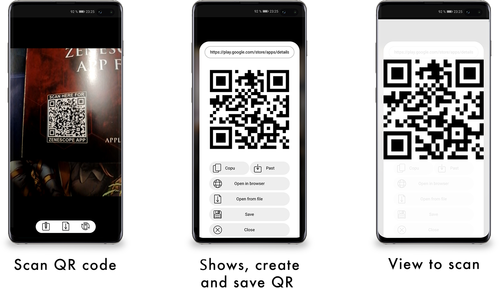

# QR MASTER
To scan, point the selected camera on a qr code or select a picture from your gallery.

The result obtained does not open immediately in the Internet browser, but is displayed in the preview field where it can be edited, opened in the browser, or saved in the device's memory, which allows encrypting not only Internet links, but also any other text such as a phone number or email.

To encrypt the text and create a qr code, enter the text in the appropriate field, after generating the code, it can be saved in the device's memory in .png format or scanned to other devices.

Key Features:
- Scan through any available camera on device
- Preview and edit the result
- Encrypt text into a QR code
- Save QR codes in the device memory

Created https://wahyu9kdl.github.io
For web browsers https://wahyu9kdl.github.io/application/qr-master

# IMAGE QR EXCAMPLE

 
 ### TABEL APLIKASI QR GRNERATOR 

<google-sheets-html-origin>

<table border="1" cellpadding="0" cellspacing="0" dir="ltr" style="border-collapse: collapse; border: none; font-family: Arial; font-size: 10pt; table-layout: fixed; width: 0px;" xmlns="http://www.w3.org/1999/xhtml"><colgroup><col width="40"><col width="442"><col width="327"></colgroup>

<tbody>

<tr style="height: 21px;">

<td colspan="3" data-sheets-value="[null,2,&quot;TABEL APLIKASI QR GENERATOR&quot;]" rowspan="1" style="font-size: 24pt; font-weight: bold; overflow: hidden; padding: 2px 3px 2px 3px; text-align: center; text-rotation: 0; vertical-align: middle;">TABEL APLIKASI QR GENERATOR</td>

</tr>

<tr style="height: 21px;">

<td data-sheets-value="[null,2,&quot;NO&quot;]" style="font-size: 12pt; font-weight: bold; overflow: hidden; padding: 2px 3px 2px 3px; text-align: center; text-rotation: 45; vertical-align: middle;">NO</td>

<td data-sheets-value="[null,2,&quot;TITLE&quot;]" style="font-size: 12pt; font-weight: bold; overflow: hidden; padding: 2px 3px 2px 3px; text-align: center; text-rotation: 45; vertical-align: middle;">TITLE</td>

<td data-sheets-value="[null,2,&quot;LINK&quot;]" style="font-size: 12pt; font-weight: bold; overflow: hidden; padding: 2px 3px 2px 3px; text-align: center; text-rotation: 45; vertical-align: middle;">LINK</td>

</tr>

<tr style="height: 21px;">

<td data-sheets-value="{&quot;1&quot;:3,&quot;3&quot;:1.0}" style="font-size: 12pt; font-weight: bold; overflow: hidden; padding: 2px 3px 2px 3px; text-align: center; text-rotation: 45; vertical-align: middle;">1</td>

<td data-sheets-value="[null,2,&quot;QR Codes for Business Services - Awdev Corporation&quot;]" style="font-size: 12pt; font-weight: bold; overflow: hidden; padding: 2px 3px 2px 3px; text-align: center; text-rotation: 45; vertical-align: middle;">QR Codes for Business Services - Awdev Corporation</td>

<td data-sheets-hyperlink="https://qr.awdev.my.id/" data-sheets-value="[null,2,&quot;https://qr.awdev.my.id/&quot;]" style="color: #1155cc; font-size: 12pt; font-weight: bold; overflow: hidden; padding: 2px 3px; text-align: center; text-decoration-line: underline; vertical-align: middle;">[https://qr.awdev.my.id/](https://qr.awdev.my.id/)</td>

</tr>

<tr style="height: 21px;">

<td data-sheets-value="{&quot;1&quot;:3,&quot;3&quot;:2.0}" style="font-size: 12pt; font-weight: bold; overflow: hidden; padding: 2px 3px 2px 3px; text-align: center; text-rotation: 45; vertical-align: middle;">2</td>

<td data-sheets-value="[null,2,&quot;Aplikasi Clients Production QR MASTER scanner coder decoder&quot;]" style="font-size: 12pt; font-weight: bold; overflow: hidden; padding: 2px 3px 2px 3px; text-align: center; text-rotation: 45; vertical-align: middle;">Aplikasi Clients Production QR MASTER scanner coder decoder</td>

<td data-sheets-hyperlink="https://qr.awdev.my.id/v1/" data-sheets-value="[null,2,&quot;https://qr.awdev.my.id/v1/&quot;]" style="color: #1155cc; font-size: 12pt; font-weight: bold; overflow: hidden; padding: 2px 3px; text-align: center; text-decoration-line: underline; vertical-align: middle;">[https://qr.awdev.my.id/v1/](https://qr.awdev.my.id/v1/)</td>

</tr>

<tr style="height: 21px;">

<td data-sheets-value="{&quot;1&quot;:3,&quot;3&quot;:3.0}" style="font-size: 12pt; font-weight: bold; overflow: hidden; padding: 2px 3px 2px 3px; text-align: center; text-rotation: 45; vertical-align: middle;">3</td>

<td data-sheets-value="[null,2,&quot;Free Online QR Code Generator to make your own QR Codes \u000a&quot;]" style="font-size: 12pt; font-weight: bold; overflow: hidden; padding: 2px 3px 2px 3px; text-align: center; text-rotation: 45; vertical-align: middle;">Free Online QR Code Generator to make your own QR Codes</td>

<td data-sheets-hyperlink="https://qr.awdev.my.id/v2/" data-sheets-value="[null,2,&quot;https://qr.awdev.my.id/v2/&quot;]" style="color: #1155cc; font-size: 12pt; font-weight: bold; overflow: hidden; padding: 2px 3px; text-align: center; text-decoration-line: underline; vertical-align: middle;">[https://qr.awdev.my.id/v2/](https://qr.awdev.my.id/v2/)</td>

</tr>

<tr style="height: 21px;">

<td data-sheets-value="{&quot;1&quot;:3,&quot;3&quot;:4.0}" style="font-size: 12pt; font-weight: bold; overflow: hidden; padding: 2px 3px 2px 3px; text-align: center; text-rotation: 45; vertical-align: middle;">4</td>

<td data-sheets-value="[null,2,&quot;Free Online QR Codes for Business Services V3 - Awdev Corporation\u000a&quot;]" style="font-size: 12pt; font-weight: bold; overflow: hidden; padding: 2px 3px 2px 3px; text-align: center; text-rotation: 45; vertical-align: middle;">Free Online QR Codes for Business Services V3 - Awdev Corporation</td>

<td data-sheets-hyperlink="https://qr.awdev.my.id/v3/" data-sheets-value="[null,2,&quot;https://qr.awdev.my.id/v3/&quot;]" style="color: #1155cc; font-size: 12pt; font-weight: bold; overflow: hidden; padding: 2px 3px; text-align: center; text-decoration-line: underline; vertical-align: middle;">[https://qr.awdev.my.id/v3/](https://qr.awdev.my.id/v3/)</td>

</tr>

<tr style="height: 21px;">

<td data-sheets-value="{&quot;1&quot;:3,&quot;3&quot;:5.0}" style="font-size: 12pt; font-weight: bold; overflow: hidden; padding: 2px 3px 2px 3px; text-align: center; text-rotation: 45; vertical-align: middle;">5</td>

<td data-sheets-value="[null,2,&quot;Free Online QR Codes Whatsapp for Business Services V4 - Awdev Corporation\u000a&quot;]" style="font-size: 12pt; font-weight: bold; overflow: hidden; padding: 2px 3px 2px 3px; text-align: center; text-rotation: 45; vertical-align: middle;">Free Online QR Codes Whatsapp for Business Services V4 - Awdev Corporation</td>

<td data-sheets-hyperlink="https://qr.awdev.my.id/v4/" data-sheets-value="[null,2,&quot;https://qr.awdev.my.id/v4/&quot;]" style="color: #1155cc; font-size: 12pt; font-weight: bold; overflow: hidden; padding: 2px 3px; text-align: center; text-decoration-line: underline; vertical-align: middle;">[https://qr.awdev.my.id/v4/](https://qr.awdev.my.id/v4/)</td>

</tr>

<tr style="height: 21px;">

<td data-sheets-value="{&quot;1&quot;:3,&quot;3&quot;:6.0}" style="font-size: 12pt; font-weight: bold; overflow: hidden; padding: 2px 3px 2px 3px; text-align: center; text-rotation: 45; vertical-align: middle;">6</td>

<td data-sheets-value="[null,2,&quot;Whatsapp Link and QR Generator AWDEV\u000a\u000a&quot;]" style="font-size: 12pt; font-weight: bold; overflow: hidden; padding: 2px 3px 2px 3px; text-align: center; text-rotation: 45; vertical-align: middle;">Whatsapp Link and QR Generator AWDEV</td>

<td data-sheets-hyperlink="http://devoloper.awdev.eu.org/tools/wa-qr.html" data-sheets-value="[null,2,&quot;http://devoloper.awdev.eu.org/tools/wa-qr.html&quot;]" style="color: #1155cc; font-size: 12pt; font-weight: bold; overflow: hidden; padding: 2px 3px; text-align: center; text-decoration-line: underline; vertical-align: middle;">[http://devoloper.awdev.eu.org/tools/wa-qr.html](http://devoloper.awdev.eu.org/tools/wa-qr.html)</td>

</tr>

<tr style="height: 21px;">

<td data-sheets-value="{&quot;1&quot;:3,&quot;3&quot;:7.0}" style="font-size: 12pt; font-weight: bold; overflow: hidden; padding: 2px 3px 2px 3px; text-align: center; text-rotation: 45; vertical-align: middle;">7</td>

<td data-sheets-value="[null,2,&quot;QR GENERATOR FACEBOOK Awfanspage\u000a\u000a&quot;]" style="font-size: 12pt; font-weight: bold; overflow: hidden; padding: 2px 3px 2px 3px; text-align: center; text-rotation: 45; vertical-align: middle;">QR GENERATOR FACEBOOK Awfanspage</td>

<td data-sheets-hyperlink="http://devoloper.awdev.eu.org/tools/fb-qr.html" data-sheets-value="[null,2,&quot;http://devoloper.awdev.eu.org/tools/fb-qr.html&quot;]" style="color: #1155cc; font-size: 12pt; font-weight: bold; overflow: hidden; padding: 2px 3px; text-align: center; text-decoration-line: underline; vertical-align: middle;">[http://devoloper.awdev.eu.org/tools/fb-qr.html](http://devoloper.awdev.eu.org/tools/fb-qr.html)</td>

</tr>

<tr style="height: 21px;">

<td data-sheets-value="{&quot;1&quot;:3,&quot;3&quot;:8.0}" style="font-size: 12pt; font-weight: bold; overflow: hidden; padding: 2px 3px 2px 3px; text-align: center; text-rotation: 45; vertical-align: middle;">8</td>

<td data-sheets-value="[null,2,&quot;QR Code scanner\u000a&quot;]" style="font-size: 12pt; font-weight: bold; overflow: hidden; padding: 2px 3px 2px 3px; text-align: center; text-rotation: 45; vertical-align: middle;">QR Code scanner</td>

<td data-sheets-hyperlink="http://devoloper.awdev.eu.org/tools/QR/" data-sheets-value="[null,2,&quot;http://devoloper.awdev.eu.org/tools/QR/&quot;]" style="color: #1155cc; font-size: 12pt; font-weight: bold; overflow: hidden; padding: 2px 3px; text-align: center; text-decoration-line: underline; vertical-align: middle;">[http://devoloper.awdev.eu.org/tools/QR/](http://devoloper.awdev.eu.org/tools/QR/)</td>

</tr>

<tr style="height: 21px;">

<td data-sheets-value="{&quot;1&quot;:3,&quot;3&quot;:9.0}" style="font-size: 12pt; font-weight: bold; overflow: hidden; padding: 2px 3px 2px 3px; text-align: center; text-rotation: 45; vertical-align: middle;">9</td>

<td data-sheets-value="[null,2,&quot;ABOUT TOOLS KODE QR GENERATOR\u000aAWDEV DEVOLOPER\u000a\u000a&quot;]" style="font-size: 12pt; font-weight: bold; overflow: hidden; padding: 2px 3px 2px 3px; text-align: center; text-rotation: 45; vertical-align: middle;">ABOUT TOOLS KODE QR GENERATOR AWDEV DEVOLOPER</td>

<td data-sheets-hyperlink="http://devoloper.awdev.eu.org/tools/QR/about.html" data-sheets-value="[null,2,&quot;http://devoloper.awdev.eu.org/tools/QR/about.html&quot;]" style="color: #1155cc; font-size: 12pt; font-weight: bold; overflow: hidden; padding: 2px 3px; text-align: center; text-decoration-line: underline; vertical-align: middle;">[http://devoloper.awdev.eu.org/tools/QR/about.html](http://devoloper.awdev.eu.org/tools/QR/about.html)</td>

</tr>

<tr style="height: 21px;">

<td data-sheets-value="{&quot;1&quot;:3,&quot;3&quot;:10.0}" style="font-size: 12pt; font-weight: bold; overflow: hidden; padding: 2px 3px 2px 3px; text-align: center; text-rotation: 45; vertical-align: middle;">10</td>

<td data-sheets-value="[null,2,&quot;Create QR Code Generator - AWDEV DEVOLOPER\u000a\u000a\u000a&quot;]" style="font-size: 12pt; font-weight: bold; overflow: hidden; padding: 2px 3px 2px 3px; text-align: center; text-rotation: 45; vertical-align: middle;">Create QR Code Generator - AWDEV DEVOLOPER</td>

<td data-sheets-hyperlink="https://devoloper.awdev.eu.org/tools/QR/create.html" data-sheets-value="[null,2,&quot;https://devoloper.awdev.eu.org/tools/QR/create.html&quot;]" style="color: #1155cc; font-size: 12pt; font-weight: bold; overflow: hidden; padding: 2px 3px; text-align: center; text-decoration-line: underline; vertical-align: middle;">[https://devoloper.awdev.eu.org/tools/QR/create.html](https://devoloper.awdev.eu.org/tools/QR/create.html)</td>

</tr>

<tr style="height: 21px;">

<td data-sheets-value="{&quot;1&quot;:3,&quot;3&quot;:11.0}" style="font-size: 12pt; font-weight: bold; overflow: hidden; padding: 2px 3px 2px 3px; text-align: center; text-rotation: 45; vertical-align: middle;">11</td>

<td data-sheets-value="[null,2,&quot;HERO Aplikasi Clients Production QR scanner coder decoder\u000a\u000a&quot;]" style="font-size: 12pt; font-weight: bold; overflow: hidden; padding: 2px 3px 2px 3px; text-align: center; text-rotation: 45; vertical-align: middle;">HERO Aplikasi Clients Production QR scanner coder decoder</td>

<td data-sheets-hyperlink="https://wahyu9kdl.github.io/hero/app/qr/index.html" data-sheets-value="[null,2,&quot;https://wahyu9kdl.github.io/hero/app/qr/index.html&quot;]" style="color: #1155cc; font-size: 12pt; font-weight: bold; overflow: hidden; padding: 2px 3px; text-align: center; text-decoration-line: underline; vertical-align: middle;">[https://wahyu9kdl.github.io/hero/app/qr/index.html](https://wahyu9kdl.github.io/hero/app/qr/index.html)</td>

</tr>

<tr style="height: 21px;">

<td data-sheets-value="{&quot;1&quot;:3,&quot;3&quot;:12.0}" style="font-size: 12pt; font-weight: bold; overflow: hidden; padding: 2px 3px 2px 3px; text-align: center; text-rotation: 45; vertical-align: middle;">12</td>

<td data-sheets-value="[null,2,&quot;Application ED QR scanner coder decoder&quot;]" style="font-size: 12pt; font-weight: bold; overflow: hidden; padding: 2px 3px 2px 3px; text-align: center; text-rotation: 45; vertical-align: middle;">Application ED QR scanner coder decoder</td>

<td data-sheets-hyperlink="https://wahyu9kdl.github.io/application/qr-master" data-sheets-value="[null,2,&quot;https://wahyu9kdl.github.io/application/qr-master&quot;]" style="color: #1155cc; font-size: 12pt; font-weight: bold; overflow: hidden; padding: 2px 3px; text-align: center; text-decoration-line: underline; vertical-align: middle;">[https://wahyu9kdl.github.io/application/qr-master](https://wahyu9kdl.github.io/application/qr-master)</td>

</tr>

<tr style="height: 21px;">

<td data-sheets-value="{&quot;1&quot;:3,&quot;3&quot;:13.0}" style="font-size: 12pt; font-weight: bold; overflow: hidden; padding: 2px 3px 2px 3px; text-align: center; text-rotation: 45; vertical-align: middle;">13</td>

<td data-sheets-value="[null,2,&quot;Aplikasi Clients Production QR scanner coder decoder&quot;]" style="font-size: 12pt; font-weight: bold; overflow: hidden; padding: 2px 3px 2px 3px; text-align: center; text-rotation: 45; vertical-align: middle;">Aplikasi Clients Production QR scanner coder decoder</td>

<td data-sheets-hyperlink="https://wahyu9kdl.github.io/application/qr-master/client.html" data-sheets-value="[null,2,&quot;https://wahyu9kdl.github.io/application/qr-master/client.html&quot;]" style="color: #1155cc; font-size: 12pt; font-weight: bold; overflow: hidden; padding: 2px 3px; text-align: center; text-decoration-line: underline; vertical-align: middle;">[https://wahyu9kdl.github.io/application/qr-master/client.html](https://wahyu9kdl.github.io/application/qr-master/client.html)</td>

</tr>

<tr style="height: 21px;">

<td data-sheets-value="{&quot;1&quot;:3,&quot;3&quot;:14.0}" style="font-size: 12pt; font-weight: bold; overflow: hidden; padding: 2px 3px 2px 3px; text-align: center; text-rotation: 45; vertical-align: middle;">14</td>

<td data-sheets-value="[null,2,&quot;Products ED QR scanner coder decoder&quot;]" style="font-size: 12pt; font-weight: bold; overflow: hidden; padding: 2px 3px 2px 3px; text-align: center; text-rotation: 45; vertical-align: middle;">Products ED QR scanner coder decoder</td>

<td data-sheets-hyperlink="https://wahyu9kdl.github.io/application/qr-master/product.html" data-sheets-value="[null,2,&quot;https://wahyu9kdl.github.io/application/qr-master/product.html&quot;]" style="color: #1155cc; font-size: 12pt; font-weight: bold; overflow: hidden; padding: 2px 3px; text-align: center; text-decoration-line: underline; vertical-align: middle;">[https://wahyu9kdl.github.io/application/qr-master/product.html](https://wahyu9kdl.github.io/application/qr-master/product.html)</td>

</tr>

<tr style="height: 21px;">

<td data-sheets-value="{&quot;1&quot;:3,&quot;3&quot;:15.0}" style="font-size: 12pt; font-weight: bold; overflow: hidden; padding: 2px 3px 2px 3px; text-align: center; text-rotation: 45; vertical-align: middle;">15</td>

<td data-sheets-value="[null,2,&quot;QR Generator - Free Online Tools Awdev&quot;]" style="font-size: 12pt; font-weight: bold; overflow: hidden; padding: 2px 3px 2px 3px; text-align: center; text-rotation: 45; vertical-align: middle;">QR Generator - Free Online Tools Awdev</td>

<td data-sheets-hyperlink="https://wahyu9kdl.github.io/HTML/TOOLS/QR.html" data-sheets-value="[null,2,&quot;https://wahyu9kdl.github.io/HTML/TOOLS/QR.html&quot;]" style="color: #1155cc; font-size: 12pt; font-weight: bold; overflow: hidden; padding: 2px 3px; text-align: center; text-decoration-line: underline; vertical-align: middle;">[https://wahyu9kdl.github.io/HTML/TOOLS/QR.html](https://wahyu9kdl.github.io/HTML/TOOLS/QR.html)</td>

</tr>

<tr style="height: 21px;">

<td data-sheets-value="{&quot;1&quot;:3,&quot;3&quot;:16.0}" style="font-size: 12pt; font-weight: bold; overflow: hidden; padding: 2px 3px 2px 3px; text-align: center; text-rotation: 45; vertical-align: middle;">16</td>

<td data-sheets-value="[null,2,&quot;QR Code - Free Online Tools&quot;]" style="font-size: 12pt; font-weight: bold; overflow: hidden; padding: 2px 3px 2px 3px; text-align: center; text-rotation: 45; vertical-align: middle;">QR Code - Free Online Tools</td>

<td data-sheets-hyperlink="https://wahyu9kdl.github.io/HTML/TOOLS/qr.html" data-sheets-value="[null,2,&quot;https://wahyu9kdl.github.io/HTML/TOOLS/qr.html&quot;]" style="color: #1155cc; font-size: 12pt; font-weight: bold; overflow: hidden; padding: 2px 3px; text-align: center; text-decoration-line: underline; vertical-align: middle;">[https://wahyu9kdl.github.io/HTML/TOOLS/qr.html](https://wahyu9kdl.github.io/HTML/TOOLS/qr.html)</td>

</tr>

</tbody>

</table>

</google-sheets-html-origin>

