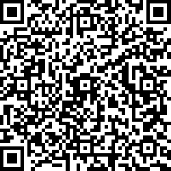

# QR MASTER
To scan, point the selected camera on a qr code or select a picture from your gallery.

The result obtained does not open immediately in the Internet browser, but is displayed in the preview field where it can be edited, opened in the browser, or saved in the device's memory, which allows encrypting not only Internet links, but also any other text such as a phone number or email.

To encrypt the text and create a qr code, enter the text in the appropriate field, after generating the code, it can be saved in the device's memory in .png format or scanned to other devices.

Key Features:
- Scan through any available camera on device
- Preview and edit the result
- Encrypt text into a QR code
- Save QR codes in the device memory

Created https://wahyu9kdl.github.io
For web browsers https://wahyu9kdl.github.io/application/qr-master

# IMAGE QR EXCAMPLE

